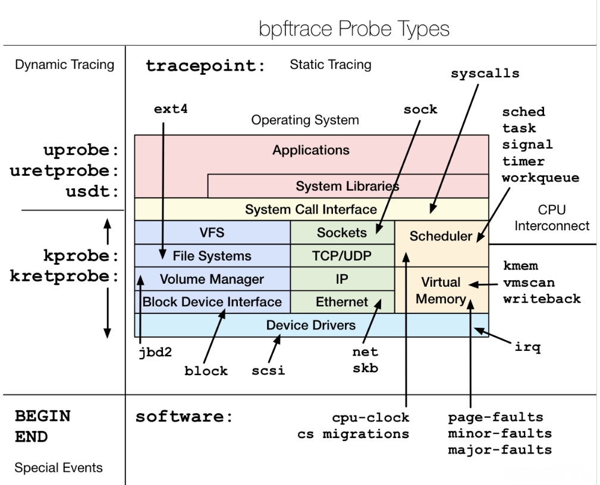

## bpftrace

- 探针

- 

  kprobeb/kretprobe为动态跟踪、内核级探针，kprobeb是检测函数执行的开始，kretprobe为检测结束（返回）

  uprobe/uretprobe为动态跟踪、用户级探针，uprobeb是检测用户级函数执行的开始，uretprobe为检测结束（返回）。tracepoint为静态跟踪、用户级探针

- 单行命令

```shell
bpftrace -e 'BEGIN { printf("Hello world!\n"); }'
bpftrace -e 'kprobe:vfs_read { @[tid] = count();}'
bpftrace -e 'kprobe:vfs_read  /pid == 123/ { @[tid, comm] = count();}'
bpftrace -e 't:block:block_rq_insert { @[kstack] = count(); }'
```

- 语法

  ```shell
  probes /filter/ { actions }
  ```

  - `probes`表示事件 tracepoint、kprobe、kretprobe、uprobe、BEGIN、END
  - `filter`表示过滤条件 当一个事件触发时，会先判断该条件，满足条件才会执行后面的action行为
  - `action`表示具体操作

  - `bpftrace -e 'kprobe:vfs_read  /pid == 123/ { @[tid, comm] = count();}'`

- 变量

  - 内部变量（build-in）

  - ```c
    uid:用户id
    tid：线程id
    pid：进程id
    cpu：cpu id
    cgroup：cgroup id
    probe：当前的trace点
    comm：进程名字
    nsecs：纳秒级别的时间戳
    kstack：内核栈回溯
    ustack - 用户栈回溯
    curtask：当前进程的task_struct地址
    args:获取该kprobe或者tracepoint的参数列表
    arg0:获取该kprobe的第一个变量，tracepoint不可用
    arg1:获取该kprobe的第二个变量，tracepoint不可用
    arg2:获取该kprobe的第三个变量，tracepoint不可用
    retval: kretprobe中获取函数返回值
    args->ret: kretprobe中获取函数返回值
    ```

- 使用`-v`选项可以列出tracepoint类型跟踪点的参数

  ```c
  # bpftrace -lv tracepoint:syscalls:sys_enter_shmctl
  tracepoint:syscalls:sys_enter_shmctl
      int __syscall_nr;
      int shmid;
      int cmd;
      struct shmid_ds * buf;
  ```