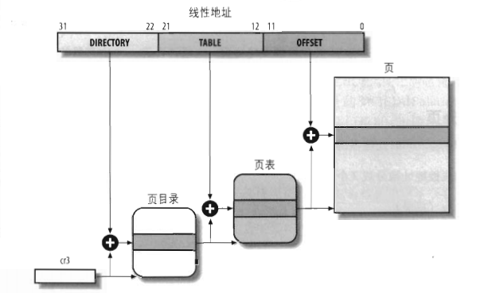
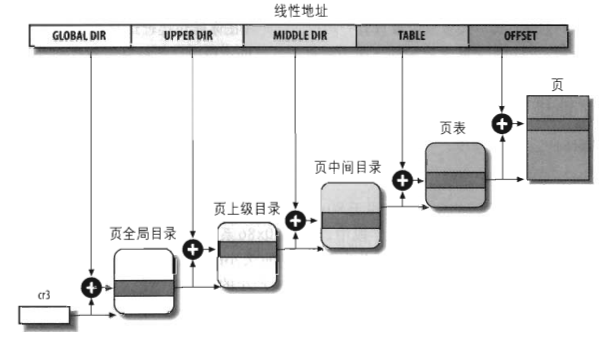
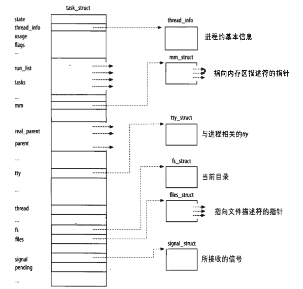

title: linux kernel 基础知识

date: 2024-07-10 10:09:00

tags:

categories: 

---

[TOC]

## 内存寻址

### 内存地址

​	逻辑地址：用来指定一个操作数或一条指令的地址，段（segment）+偏移量（offset | displacement），偏移量指明了从段开始的地方到实际地址之间的距离

​	线性地址：也称作虚拟地址，32位无符号整数，通常用十六位进制数表示，值的范围从0x00000000~0xffffffff

​	物理地址：内存芯片级内存单元寻址

​	在内存寻址中，我们通常以字节为单位

### 段选择符和段寄存器

​	逻辑地址：段标识符+段内相对地址偏移量

​	**段标识符**是一个16位长的字段，成为**段选择符**

​	段寄存器：快速查找段选择符，cs，ss，ds，es，fs，gs，程序可以把同一个段寄存器用于不同的目的，先将其值保存在内存中，用完后再恢复

​		cs：代码段寄存器，指向包含程序指令的段，它含有一个两位的字段，指明CPU当前的特权级（CPL），0内核态，3用户态

​		ss：栈段寄存器，指向包含当前程序栈的段

​		ds：数据段寄存器，指向包含静态数据或全局数据段

### 段描述符

​	每个段由一个8字节的段描述符表示，它描述段的特征。放在全局描述符表（GDT）或局部描述符表（LDT）中。

​	通常只定义一个GDT，而每个进程除了存放在GDT的段以外如果还需创建附加段就可以有自己的LDT。GDT在主存中的地址和大小放在gdtr控制寄存器中，当前正被使用的LDT地址和大小放在ldtr控制寄存器中

​	段描述符字段

| 字段名  | 描述                                                         |
| ------- | ------------------------------------------------------------ |
| Base    | 段首地址的线性地址                                           |
| G       | 粒度标志：如果该位清0，则段大小以字节为单位，否则以4096字节的倍数计 |
| Limit   | 存放段中最后一个内存单元的偏移量，从而决定段的长度。如果G被置为0，则一个段的大小在1个字节到1MB之间变化；否则，将在4KB到4GB之间变化 |
| S       | 系统标志：如果它被清0，则这是一个系统段，存储诸如LDT这种关键的数据结构，否则它是一个普通的代码段或数据段 |
| Type    | 描述了段的类型特征和它的存取权限（请看表下面的描述）         |
| DPL     | 描述符特权级（Descriptor Privilege Level）字段：用于限制对这个段的存取。它表示为访问这个段而要求的CPU最小的优先级。因此，DPL设为0的段只能当CPL为0时（即在内核态）才是可访问的，而DPL设为3的段对任何CPL值都是可访问的 |
| P       | Segment-Present标志：等于0表示段当前不在主存中。Linux总是把这个标志（第47位）设为1，因为它从来不把整个段交换到磁盘上去 |
| D或B    | 称为D或B的标志，取决于是代码段还是数据段。D或B的含义在两种情况下稍微有所区别，但是如果段偏移量的地址是32位长，就基本上把它置为1，如果这个偏移量是16位长，它被清0（更详细的描述参见Intel使用手册） |
| AVL标志 | 可以由操作系统使用，但是被Linux忽略                          |

### 段选择符字段

| 字段名 | 描述                                                         |
| ------ | ------------------------------------------------------------ |
| index  | 指定了放在GDT或LDT中的相应段描述符的入口                     |
| TI     | （Table Indicator）标志，指明段描述符是在GDT中（TI=0）或在LDT中（TI=1） |
| RPL    | 请求者特权级：当相应的段选择符装入到cs寄存器中时指示出CPU当前的特权级，它还可以用于在访问数据段时有选择地削弱处理器的特权级 |

### 分段单元

​	逻辑地址	---->	线性地址

​	从段选择符的index字段计算段描述符的地址，index字段乘以8（一个段描述符大小），结果与gdtr或ldtr相加

​	逻辑地址偏移量+段描述符地址	--->	线性地址

### Linux中的分段

​	分段可以给每一个进程分配不同的线性地址空间

​	分页可以把同一线性地址空间映射到不同的物理空间（Linux多用这个）

### 硬件中的分页

​	分页单元把线性地址转换为物理地址

​	其中一个关键任务，把请求访问的类型和线性地址的访问权限相比较，如果这次内存访问无效，就产生一个缺页异常

​	线性地址被分为以固定长度位单位的组，称为**页**。页内部连续的线性地址被映射到连续的物理地址中

​	分页单元把所有RAM分成固定长度的**页框（page frame）**（有时叫做物理页）。每一个页框包含一个页（page），也就是说一个页框的长度与一个页的长度一致。页框是主存的一部分，因此也是一个存储区域。页只是一个数据块，可以存放在任何页框或磁盘中。

​	把线性地址映射到物理地址的数据结构称为**页表（page table）**。页表存放在主存中，并在启用分页单元之前必须由内核对页表进行适当的初始化

​	正在使用的页目录的物理地址存放在控制寄存器cr3中。线性地址内的Directory字段决定页目录中的目录项，而目录项指向适当的页表。地址的Table字段依次又决定页表中的表项，而表项含有页所在页框的物理地址。Offset字段决定页框内的相对位置。由于它是12位长，故每一页含有4096字节的数据

### Linux中的分页

​	四级分页模型

 - 页全局目录
 - 页上级目录
 - 页中级目录
 - 页表

## 进程

​	进程是程序执行时的一个实例，从内核的观点看，进程的目的就是担当分配系统资源（CPU时间、内存等）的实体

​	当一个进程创建时，它几乎与父进程相同。它接受父进程地址空间的一个（逻辑）拷贝，并从进程创建系统调用的下一条指令开始执行与父进程相同的代码。尽管父子进程可以共享含有程序代码（正文）的页，但是它们各自有独立的数据拷贝（栈和堆），因此子进程对一个内存单元的修改对父进程是不可见的（反之亦然）

​	Linux使用轻量级进程（lightweight process）对多线程应用程序提供更好的支持。两个轻量级进程基本上可以共享一些资源，诸如地址空间、打开的文件等等。只要其中一个修改共享资源，另一个就立即查看这种修改。当然，当两个线程访问共享资源时就必须同步它们自己。

### 进程描述符

### 进程状态

state字段描述了进程当前所处的状态

可运行状态（TASK_RUNNING)
		进程要么在CPU上执行，要么准备执行。

可中断的等待状态（TASK_INTERRUPTIBLE)
		进程被挂起（睡眠），直到某个条件变为真。产生一个硬件中断，释放进程正等待的系统资源，或传递一个信号都是可以唤醒进程的条件（把进程的状态放回到TASK_RUNNING).

不可中断的等待状态（TASK_UNINTERRUPTIBLE)
		与可中断的等待状态类似，但有一个例外，把信号传递到睡眠进程不能改变它的状态。这种状态很少用到，但在一些特定的情况下（进程必须等待，直到一个不能被中断的事件发生），这种状态是很有用的。例如，当进程打开一个设备文件，其相应的设备驱动程序开始探测相应的硬件设备时会用到这种状态。探测完成以前，设备驱动程序不能被中断，否则，硬件设备会处于不可预知的状态。

暂停状态（TASK_STOPPED)
		进程的执行被暂停。当进程接收到SIGSTOP、SIGTSTP、SIGTTIN或SIGTTOU信号后，进入暂停状态。

跟踪状态（TASK_TRACED)
		进程的执行已由debugger程序暂停。当一个进程被另一个进程监控时（例如debugger执行ptrace（）系统调用监控一个测试程序），任何信号都可以把这个进程置于TASK_TRACED状态。

还有两个进程状态是既可以存放在进程描述符的state字段中，也可以存放在exit_state字段中。从这两个字段的名称可以看出，只有当进程的执行被终止时，进程的状态才会变为这两种状态中的一种：

僵死状态（EXIT_ZOMBIE）
		进程的执行被终止，但是，父进程还没有发布wait4（）或waitpid（）系统调用来返回有关死亡进程的信息。发布wait（）类系统调用前，内核不能丢弃包含在死进程描述符中的数据，因为父进程可能还需要它

僵死撤消状态（EXIT_DEAD)
		最终状态：由于父进程刚发出 wait4（）或waitpid（）系统调用，因而进程由系统删除。为了防止其他执行线程在同一个进程上也执行wait（）类系统调用（这是一种竞争条件），而把进程的状态由優死（EXIT_ZOMBIE）状态改为死撤消状态(EXIT-DEAD）参见第五）。

### 硬件上下文

​	进程恢复执行前必须装入寄存器的一组数据称为硬件上下文。硬件上下文是进程可执行上下文的一个子集，因为可执行上下文包含进程执行时需要的所有信息。在Linux中，进程硬件上下文的一部分存放在TSS段，而剩余部分存放在内核态堆栈中。

### 任务状态段（TSS）

​	存放硬件上下文

## 中断和异常

中断（interrupt）通常被定义为一个事件，该事件改变处理器执行的指令顺序。这样的事件与CPU芯片内外部硬件电路产生的电信号相对应。
中断通常分为同步（synchronous）中断和异步（asynchronous）中断：

- 同步中断是当指令执行时由CPU控制单元产生的，之所以称为同步，是因为只有在一条指令终止执行后CPU才会发出中断。
- 异步中断是由其他硬件设备依照CPU时钟信号随机产生的。

在Intel微处理器手册中，把同步和异步中断分别称为**异常**（exception）和**中断**（interrupt）。我们也采用这种分类，当然有时我们也用术语“中断信号”指这两种类型（同步及异步）。

中断是由间隔定时器和I/O设备产生的，例如，用户的一次按键会引起一个中断。另一方面，异常是由程序的错误产生的，或者是由内核必须处理的异常条件产生的。第一种情况下，内核通过发送一个每个Unix程序员都熟悉的信号来处理异常。第二种情况下，内核执行恢复异常需要的所有步骤，例如缺页，或对内核服务的一个请求（通过一条int或sysenter指令）。

### 中断和异常

 - 中断：

   - 可屏蔽中断

     I/O设备发出的所有中断请求（IRQ)都产生可屏蔽中断。可屏蔽中断可以处于两种状态：屏蔽的（masked）或非屏蔽的（unmasked）：一个屏蔽的中断只要还是屏蔽的，控制单元就忽略它。

   - 非屏蔽中断

     只有几个危急事件（如硬件故障）才引起非屏蔽中断，非屏蔽中断总是由CPU辨认

 - 异常

   - 处理器探测异常

     当CPU执行指令时探测到的一个反常条件所产生的异常。可以进一步分为三组，这取决于CPU控制单元产生异常时保存在内核态堆栈eip寄存器（在 x86 指令集中，EIP 寄存器存储着 CPU 将要执行的下一条指令的内存地址）中的值。

     - 故障

       通常可以纠正；一且纠正，程序就可以在不失连贯性的情况下重新开始。保存在eip中的值是引起故障的指令地址，因此，当异常处理程序终止时，那条指令会被重新执行。我们将在“缺页异常处理程序”一节中看到，只要处理程序能纠正引起异常的反常条件，重新执行同一指令就是必要的。

     - 陷阱

       在陷指令执行后立即报告：内核把控制权返回给程序后就可以继续它的执行而不失连贯性。保存在eip中的值是一个随后要执行的指令地址。只有当没有必要重新执行已终止的指令时，才触发陷阱。陷阱的主要用途是为了调试程序。在这种情况下，中断信号的作用是通知调试程序一条特殊指令已被执行（例如到了一个程序内的断点）。一旦用户检查到调试程序所提供的数据，她就可能要求被调试程序从下一条指令重新开始执行。

     - 异常终止

       发生一个严重的错误：控制单元出了问题，不能在eip寄存器中保存引起异常的指令所在的确切位置。异常中止用于报告严重的错误，如硬件故障或系统表中无效的值或不一致的值。由控制单元发送的这个中断信号是紧急信号，用来把控制权切换到相应的异常中止处理程序，这个异常中止处理程序除了强制受影响的进程终止外，没有别的选择。

     - 编程异常

       在编程者发出请求时发生。是由int或int3指令触发的：当into（检查溢出）和bound（检查地址出界）指令检查的条件不为真时，也引起编程异常。控制单元把编程异常作为陷来处理。编程异常通常也叫做软中断（software interrupt）。这样的异常有两种常用的用途：执行系统调用及给调试程序通报一个特定的事件。

每个中断和异常是由0~255之间的一个数来标识。因为一些未知的原因，Intel把这个8位的无符号整数叫做一个向量（vector）。非屏蔽中断的向量和异常的向量是固定的，而可屏蔽中断的向量可以通过对中断控制器的编程来改变。

### IRQ和中断

​	每个能够发出中断请求的硬件设备控制器都有一条名为IRQ（Interrupt ReQuest）的输出线（复杂一些的设备有几条IRQ线，例知，PCI卡可能使用多达4条IRQ线）。所有现有的IRQ线（IRQ line）都与一个名为可编程中断控制器（Programmable Interrupt Controller，PIC)的硬件电路的输入引脚相连，可编程中断控制器执行下列动作：

 	1. 监视IRQ线，检查产生的信号（raised signal）。如果有条或两条以上的IRQ线上产生信号，就选择引脚编号较小的IRQ线
 	2. 如果一个引发信号出现在IRQ线上：
 	 - 把接收到的引发信号转换成对应的向量
 	 - 把这个向量存放在中断控制器的一个I/O端口，从而允许CPU通过数据总线读取此向量
 	 - 把引发信号发送到处理器的INTR引脚，即产生一个中断
 	 - 等待，直到CPU通过把这个中断信号写进可编程中断控制器的一个I/O端口来确认他；当这种情况发生时，清INTR线
 	3. 返回到第一步

​	IRQ线是从0开始顺序编号的，因此，第一条IRQ线通常表示成IRQ0。与IRQn关联的Intel的缺省向量是n+32。如前所述，通过向中断控制器端口发布合适的指令，就可以修改IRQ和向量之间的映射。

​	可以有选择地禁止每条IRQ线。因此，可以对PIC编程从而禁止IRQ，也就是说，可以告诉PIC停止对给定的IRQ线发布中断，或者激活它们。禁止的中断是丢失不了的，它们一旦被激活，PIC就又把它们发送到CPU。这个特点被大多数中断处理程序使用，因为这允许中断处理程序逐次地处理同一类型的IRQ

### 中断描述符表

​	中断描述符表（Interrupt Descriptor Table.IDT）是一个系统表，它与每一个中断或异常向量（异常向量是一组预定义的内存地址，用于存储处理器在发生异常时应该跳转到的位置）相联系，每一个向量在表中有相应的中断或异常处理程序的入口地址。内核在允许中断发生前，必须适当地初始化IDT.

​	IDT包含三种类型的描述符：

​		任务门：当中断信号发生时，必须取代当前进程的那个进程的TSS选择符存放在任务门中。

​		中断门：包含段选择符和中断或异常处理程序的段内偏移量。当控制权转移到一个适当的段时，处理器清IF标志，从而关闭将来会发生的可屏蔽中断。

​		陷阱门：与中断门相似，只是控制权传递到一个适当的段时处理器不修改IF标志。

​	Linux利用中断门处理中断，利用陷阱门处理异常

