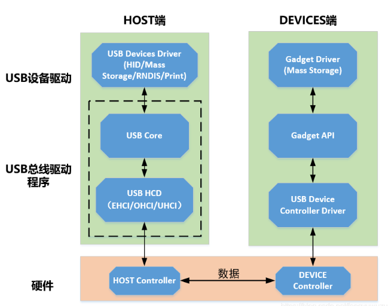
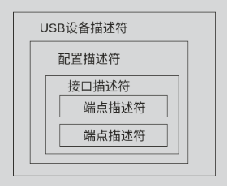

## USB子系统

### USB子系统框架

 

- USB设备驱动：用于和枚举到的USB设备进行绑定，完成特定的功能
- USB Core：用于内核USB总线的初始化及USB相关API，为设备驱动和HCD的交互提供桥梁
- USB主机控制器HCD：完成主机控制器的初始化以及数据的传输，并监测外部设备插入，完成设备枚举

### USB传输类型

- 控制传输：控制传输是双向传输，数据量通常比较小，主要指由USB总线驱动程序用来进行查询、配置以及给USB设备发送通用的命令。控制传输典型地用在主计算机和USB外设之间的端点0(Endpoint 0)之间的传输，但是指定供应商的控制传输可能用到其它的端点。比如：USB设备的识别过程。
- 批量传输：主要应用在数据大量传输，同时又没有带宽和间隔时间要求的情况下，进行可靠传输。比如：U盘拷贝数据。
- 中断传输：中断传输主要用于定时查询设备是否有中断数据要传输，设备的端点模式器的结构决定了它的查询频率，从1到255ms之间。这种传输方式典型的应用在少量的、分散的、不可预测数据的传输，比如，键盘和鼠标就属于这一类型。中断传输是单向的并且对于host来说只有输入的方式。
- 实时传输：实时传输提供了确定的带宽和间隔时间，它被用于时间严格并具有较强容错性的流数据传输，或者用于要求恒定的数据传输率的即时应用中。比如：USB摄像头。

### USB设备描述符

 

- 一个USB设备描述符中可以有多个配置描述符，即USB设备可以有多种配置；一个配置描述符中可以有多个接口描述符，即USB设备可以支持多种功能（接口）；一个接口描述符中可以有多个端点描述符。
- 一设备至少要包含设备描述符、配置描述符和接口描述符，如果USB设备没有端点描述符，则它仅仅用默认管道与主机进行数据传输。
- 接口，表示逻辑上的设备，比如USB声卡可以分为接口1-录音设备，接口2-播放设备。
- 访问设备时，即访问某个接口，接口表示逻辑设备。
- 传输数据时，即读写某个端口，端口是数据通道。

#### 设备描述符

``` c
/* USB_DT_DEVICE: Device descriptor */
struct usb_device_descriptor {
    __u8  bLength; //该结构体大小
    __u8  bDescriptorType; //描述符类型 （此处应为0x01，即设备描述符）

    __le16 bcdUSB; //usb版本号 200 -> USB2.0
    __u8  bDeviceClass; //设备类 
    __u8  bDeviceSubClass; //设备类子类
    __u8  bDeviceProtocol; //设备协议，以上三点都是USB官方定义
    __u8  bMaxPacketSize0; //端点0最大包大小 （只能为8,16,32,64）
    __le16 idVendor; //厂家id
    __le16 idProduct; //产品id
    __le16 bcdDevice; //设备出厂编号
    __u8  iManufacturer; //描述厂商信息的字符串描述符的索引值
    __u8  iProduct; //描述产品信息的字串描述符的索引值
    __u8  iSerialNumber; //描述设备序列号信息的字串描述符的索引值 
    __u8  bNumConfigurations; //可能的配置描述符的数目
} __attribute__ ((packed));
```

 USB设备描述符位于USB设备结构体usb_device中的成员descriptor中。同样地,配置、接口、端点描述符也是位于USB配置、接口、端点结构体中

```c
/**
 * struct usb_device - kernel's representation of a USB device
 */
struct usb_device {
	int		devnum;                    // 设备编号；在USB总线上的地址
	char		devpath[16];              // 设备ID字符串，用于消息（例如，/port/...）
	u32		route;                    // 树拓扑的十六进制字符串，用于xHCI
	enum usb_device_state	state;                // 设备状态：配置、未连接等
	enum usb_device_speed	speed;                // 设备速度：高/全/低（或错误）
	unsigned int		rx_lanes;              // 使用中的接收通道数量，USB 3.2添加了双通道支持
	unsigned int		tx_lanes;              // 使用中的传输通道数量，USB 3.2添加了双通道支持

	struct usb_tt	*tt;                    // 事务转换器信息；用于低/全速设备、高速集线器
	int		ttport;                   // 在事务转换器集线器上的设备端口
	unsigned int toggle[2];                   // 每个端点一个位，([0] = 输入， [1] = 输出) 端点

	struct usb_device *parent;                // 我们的集线器，除非我们是根
	struct usb_bus *bus;                      // 我们所属的总线
	struct usb_host_endpoint ep0;             // 端点0数据（默认控制管道）

	struct device dev;                        // 通用设备接口
	struct usb_device_descriptor descriptor;  // USB设备描述符
	struct usb_host_bos *bos;                 // USB设备BOS描述符集
	struct usb_host_config *config;           // 设备的所有配置

	struct usb_host_config *actconfig;        // 活动配置
	struct usb_host_endpoint *ep_in[16];      // 输入端点数组
	struct usb_host_endpoint *ep_out[16];     // 输出端点数组

	char **rawdescriptors;                    // 每个配置的原始描述符

	unsigned short bus_mA;                    // 总线可用电流
	u8 portnum;                               // 父端口号（起始值为1）
	u8 level;                                 // USB集线器祖先的数量
	u8 devaddr;                               // 设备地址，XHCI：由硬件分配，其他：与devnum相同

	unsigned can_submit:1;                    // 可以提交URB
	unsigned persist_enabled:1;               // 启用USB_PERSIST
	unsigned reset_in_progress:1;             // 设备正在复位
	unsigned have_langid:1;                   // string_langid是否有效
	unsigned authorized:1;                    // 策略已允许我们使用它
	unsigned authenticated:1;                 // 通过加密认证
	unsigned wusb:1;                          // 设备是无线USB
	unsigned lpm_capable:1;                   // 设备支持LPM
	unsigned usb2_hw_lpm_capable:1;           // 设备可以执行USB2硬件LPM
	unsigned usb2_hw_lpm_besl_capable:1;      // 设备可以执行USB2硬件BESL LPM
	unsigned usb2_hw_lpm_enabled:1;           // 启用USB2硬件LPM
	unsigned usb2_hw_lpm_allowed:1;           // 用户空间允许启用USB 2.0 LPM
	unsigned usb3_lpm_u1_enabled:1;           // 启用USB3硬件U1 LPM
	unsigned usb3_lpm_u2_enabled:1;           // 启用USB3硬件U2 LPM
	int string_langid;                        // 字符串的语言ID

	/* static strings from the device */
	char *product;                            // 如果存在，iProduct字符串（静态）
	char *manufacturer;                       // 如果存在，iManufacturer字符串（静态）
	char *serial;                             // 如果存在，iSerialNumber字符串（静态）

	struct list_head filelist;                // 此设备打开的usbfs文件

	int maxchild;                             // 如果是集线器，端口数量

	u32 quirks;                               // 设备的怪癖
	atomic_t urbnum;                          // 提交的URB数量

	unsigned long active_duration;            // 设备未挂起的总时间

#ifdef CONFIG_PM
	unsigned long connect_time;               // 设备首次连接时间

	unsigned do_remote_wakeup:1;              // 启用远程唤醒
	unsigned reset_resume:1;                  // 需要复位而不是恢复
	unsigned port_is_suspended:1;             // 上游端口被挂起（L2或U3）
#endif
	struct wusb_dev *wusb_dev;                // 如果这是无线USB设备，则链接到设备的WUSB特定数据
	int slot_id;                              // xHCI分配的插槽ID
	enum usb_device_removable removable;      // 设备可以从此端口物理移除
	struct usb2_lpm_parameters l1_params;     // USB2 L1 LPM状态的最佳努力服务延迟和L1超时
	struct usb3_lpm_parameters u1_params;     // USB3 U1 LPM状态的退出延迟和集线器启动的超时
	struct usb3_lpm_parameters u2_params;     // USB3 U2 LPM状态的退出延迟和集线器启动的超时
	unsigned lpm_disable_count;               // Ref计数用于usb_disable_lpm()和usb_enable_lpm()跟踪需要禁用USB 3.0链路电源管理的函数数量。该计数应仅由这些函数在持有带宽互斥锁时操作。

	u16 hub_delay;                            // 缓存值，包括：
	                                          // parent->hub_delay + wHubDelay + tTPTransmissionDelay (40ns)
	                                          // 将用作SetIsochDelay请求的wValue。
	unsigned use_generic_driver:1;            // 请求驱动程序核心使用通用驱动程序重新探测。
};
```

#### 配置描述符

``` c
struct usb_config_descriptor {
    __u8  bLength; //该结构体大小
    __u8  bDescriptorType;//描述符类型（本结构体中固定为0x02)  

    __le16 wTotalLength; //该配置下，信息的总长度（包括配置，接口，端点和设备类及厂商定义的描述符）
    __u8  bNumInterfaces; //接口的个数
    __u8  bConfigurationValue; //Set_Configuration命令所需要的参数值，用来选定此配置
    __u8  iConfiguration; //描述该配置的字符串描述的索引值 
    __u8  bmAttributes;//供电模式的选择  
    __u8  bMaxPower;//设备从总线提取的最大电流
} __attribute__ ((packed));
```

#### 接口描述符

配置描述符中包含了一个或多个接口描述符，这里的“接口”并不是指物理存在的接口，在这里把它称之为“功能”更易理解些，例如一个设备既有录音的功能又有扬声器的功能，则这个设备至少就有两个“接口”。

```c
struct usb_interface_descriptor {
    __u8  bLength;      //该结构体大小
    __u8  bDescriptorType;//接口描述符的类型编号(0x04）

    __u8  bInterfaceNumber;  //该接口的编号  
    __u8  bAlternateSetting; //备用的接口描述符编号  
    __u8  bNumEndpoints; //该接口使用的端点数，不包括端点0  
    __u8  bInterfaceClass; //接口类
    __u8  bInterfaceSubClass; //子类
    __u8  bInterfaceProtocol; //协议
    __u8  iInterface;//描述此接口的字串描述表的索引值  
} __attribute__ ((packed));
```

它位于usb_interface->cur_altsetting->desc 这个成员结构体里

```c
/**
 * struct usb_interface - what usb device drivers talk to
 */
struct usb_interface {
	/* array of alternate settings for this interface,
	 * stored in no particular order */
	struct usb_host_interface *altsetting;              // 备用设置的数组，无特定顺序

	struct usb_host_interface *cur_altsetting;          // 当前活动的备用设置
	unsigned num_altsetting;                            // 定义的备用设置数量

	/* If there is an interface association descriptor then it will list
	 * the associated interfaces */
	struct usb_interface_assoc_descriptor *intf_assoc;  // 接口关联描述符

	int minor;                                          // 分配给此接口的次设备号
	enum usb_interface_condition condition;             // 绑定状态
	unsigned sysfs_files_created:1;                     // sysfs属性存在
	unsigned ep_devs_created:1;                         // 端点伪设备存在
	unsigned unregistering:1;                           // 注销中
	unsigned needs_remote_wakeup:1;                     // 驱动程序需要远程唤醒
	unsigned needs_altsetting0:1;                       // 切换到备用设置0待处理
	unsigned needs_binding:1;                           // 需要延迟解除绑定/重新绑定
	unsigned resetting_device:1;                        // 复位后需要带宽分配
	unsigned authorized:1;                              // 接口授权

	struct device dev;                                  // 接口特定的设备信息
	struct device *usb_dev;                             // 如果接口绑定到USB主设备号，则指向该设备的sysfs表示
	struct work_struct reset_ws;                        // 用于在原子上下文中复位的工作结构
};
```

```c
/* host-side wrapper for one interface setting's parsed descriptors */
struct usb_host_interface {
	struct usb_interface_descriptor desc;  // 接口描述符

	int extralen;                          // 额外描述符的长度
	unsigned char *extra;                  // 额外描述符

	/* array of desc.bNumEndpoints endpoints associated with this
	 * interface setting.  these will be in no particular order.
	 */
	struct usb_host_endpoint *endpoint;    // 该接口设置关联的端点数组，无特定顺序

	char *string;                          // iInterface字符串，如果存在
};
```

#### 端点描述符

端点是设备与主机之间进行数据传输的逻辑接口，除配置使用的端点0（控制端点，一般一个设备只有一个控制端点）为双向端口外，其它均为单向。端点描述符描述了数据的传输类型、传输方向、数据包大小和端点号（也可称为端点地址）等。
除了描述符中描述的端点外，每个设备必须要有一个默认的控制型端点，地址为0，它的数据传输为双向，而且没有专门的描述符，只是在设备描述符中定义了它的最大包长度。主机通过此端点向设备发送命令，获得设备的各种描述符的信息，并通过它来配置设备。

```c
/* USB_DT_ENDPOINT: Endpoint descriptor */
struct usb_endpoint_descriptor {
    __u8  bLength;        //端点描述符字节数大小（7个字节）
    __u8  bDescriptorType;//端点描述符类型编号（0x05) 

    __u8  bEndpointAddress; //此描述表所描述的端点的地址、方向 : 
                            // bit3~bit0:端点号，bit6~bit4:保留，
                            // bit7:方向，如果是控制端点则忽略，0-输出端点（主机到设备）1-输入端点（设备到主机）
    __u8  bmAttributes; // 端点特性，bit1~bit0 表示传输类型，其他位保留
                        // 00-控制传输  01-实时传输   10-批量传输 11-中断传输
    __le16 wMaxPacketSize;  //端点收、发的最大包大小
    __u8  bInterval; // 中断传输模式中主机查询端点的时间间隔。
                     // 对于实时传输的端点此域必需为1，表示周期为1ms。对于中断传输的端点此域值的范围为1ms到255ms

    /* NOTE:  these two are _only_ in audio endpoints. */
    /* use USB_DT_ENDPOINT*_SIZE in bLength, not sizeof. */
    __u8  bRefresh;
    __u8  bSynchAddress;
} __attribute__ ((packed));
```

#### 字符串描述符

```c
struct usb_string_descriptor {
    __u8  bLength;  // 此描述表的字节数（bString域的数值N＋2）
    __u8  bDescriptorType; // 字串描述表类型（此处应为0x03）

    __le16 wData[1];        /* UTF-16LE encoded */  
} __attribute__ ((packed));
```

#### 人机接口描述符

USB 设备中有一大类就是 HID 设备，即 Human Interface Devices，人机接口设备。这类设备包括鼠标、键盘等，主要用于人与计算机进行交互。 它是 USB 协议最早支持的一种设备类。 HID 设备可以作为低速、全速、高速设备用。由于 HID 设备要求用户输入能得到及时响应，故其传输方式通常采用中断方式。 在 USB 协议中， HID 设备的定义放置在接口描述符中， USB 的设备描述符和配置描述符中不包含 HID 设备的信息。因此，对于某些特定的 HID 设备，可以定义多个接口，只有其中一个接口为 HID 设备类即可。

#### USB描述符类型值

| 类型             | 描述符           | 类型值 |
| ---------------- | ---------------- | ------ |
| 标准描述符       | 设备描述符       | 0x01   |
|                  | 配置描述符       | 0x02   |
|                  | 字符串描述符     | 0x03   |
|                  | 接口描述符       | 0x04   |
|                  | 端点描述符       | 0x05   |
| 类描述符         | 集线器类描述符   | 0x29   |
|                  | 人机接口类描述符 | 0x21   |
| 厂商定义的描述符 |                  | 0xff   |

### USB的数据传输对象

端点，一个USB设备可以有多个端点，和主机间的数据传输称为到设备端点的数据传输。比如说，对于一个U盘，可以细分为两个端点，把数据写到U盘的端点1、从U盘的端点2读取数据。

## USB总线驱动框架

### USB Core

初始化内核USB总线提供USB相关API，为设备驱动和HCD的交互提供桥梁。

> Linux启动阶段，通过**subsys_initcall**会完成USB Core的加载

```c
subsys_initcall(usb_init);
```

#### usb_init

``` c
static int __init usb_init(void)
{
	int retval;
	if (usb_disabled()) {
		pr_info("%s: USB support disabled\n", usbcore_name);
		return 0;
	}
	usb_init_pool_max();

	usb_debugfs_init();

	usb_acpi_register();
	retval = bus_register(&usb_bus_type);	//USB总线的创建
	if (retval)
		goto bus_register_failed;
	retval = bus_register_notifier(&usb_bus_type, &usb_bus_nb);
	if (retval)
		goto bus_notifier_failed;
	retval = usb_major_init();
	if (retval)
		goto major_init_failed;
	retval = usb_register(&usbfs_driver);	//注册USB接口驱动
	if (retval)
		goto driver_register_failed;
	retval = usb_devio_init();
	if (retval)
		goto usb_devio_init_failed;
	retval = usb_hub_init();				//初始化一个USB设备集线器，用来检测USB设备的连接和断开。
	if (retval)
		goto hub_init_failed;
	retval = usb_register_device_driver(&usb_generic_driver, THIS_MODULE);//注册USB设备驱动
	if (!retval)
		goto out;

	usb_hub_cleanup();
hub_init_failed:
	usb_devio_cleanup();
usb_devio_init_failed:
	usb_deregister(&usbfs_driver);
driver_register_failed:
	usb_major_cleanup();
major_init_failed:
	bus_unregister_notifier(&usb_bus_type, &usb_bus_nb);
bus_notifier_failed:
	bus_unregister(&usb_bus_type);
bus_register_failed:
	usb_acpi_unregister();
	usb_debugfs_cleanup();
out:
	return retval;
}
```

#### 注册USB总线

USB是基于总线-驱动-设备模型的框架，其初始化阶段一个重点任务就是完成USB总线的创建。usb_bus_type提供了驱动和设备匹配的匹配函数，后面注册设备和驱动时会调用到。

```c
retval = bus_register(&usb_bus_type);
if (retval) 
    goto bus_register_failed;

struct bus_type usb_bus_type = {
	.name =		"usb",
	.match =	usb_device_match,
	.uevent =	usb_uevent,
	.need_parent_lock =	true,
};
```

使用bus_register接口注册USB总线，会创建出两条链表用来分别存放向USB总线注册的设备和驱动。

```c
klist_init(&priv->klist_devices, klist_devices_get, klist_devices_put);
klist_init(&priv->klist_drivers, NULL, NULL);
```

#### 注册USB接口驱动

```c
// 在usb总线注册USB接口驱动，该驱动被放在usb总线的驱动链表中。
retval = usb_register(&usbfs_driver);
if (retval)
    goto driver_register_failed;

struct usb_driver usbfs_driver = {
    .name =     "usbfs",
    .probe =    driver_probe,
    .disconnect =   driver_disconnect,
};
```

#### 初始化USB Hub

初始化一个USB设备集线器，用来检测USB设备的连接和断开。

```c
retval = usb_hub_init();
if (retval)
    goto hub_init_failed;

int usb_hub_init(void)
{
    // 在usb总线注册一个hub驱动，该驱动被放在usb总线的驱动链表中。
	if (usb_register(&hub_driver) < 0) {
		printk(KERN_ERR "%s: can't register hub driver\n",
			usbcore_name);
		return -1;
	}

	/*
	 * The workqueue needs to be freezable to avoid interfering with
	 * USB-PERSIST port handover. Otherwise it might see that a full-speed
	 * device was gone before the EHCI controller had handed its port
	 * over to the companion full-speed controller.
	 * 工作队列需要可冻结以避免干扰 USB-PERSIST 端口切换。 
	 * 否则，在 EHCI 控制器将其端口移交给配套的全速控制器之前，它可能会发现全速设备已消失。
	 */
	hub_wq = alloc_workqueue("usb_hub_wq", WQ_FREEZABLE, 0);
	if (hub_wq)
		return 0;

	/* Fall through if kernel_thread failed */
	usb_deregister(&hub_driver);
	pr_err("%s: can't allocate workqueue for usb hub\n", usbcore_name);

	return -1;
}

static struct usb_driver hub_driver = {
	.name =		"hub",
	.probe =	hub_probe,
	.disconnect =	hub_disconnect,
	.suspend =	hub_suspend,
	.resume =	hub_resume,
	.reset_resume =	hub_reset_resume,
	.pre_reset =	hub_pre_reset,
	.post_reset =	hub_post_reset,
	.unlocked_ioctl = hub_ioctl,
	.id_table =	hub_id_table,
	.supports_autosuspend =	1,
};
```

#### 注册USB设备驱动

```c
// 在usb总线注册USB设备驱动，该驱动被放在usb总线的驱动链表中。
retval = usb_register_device_driver(&usb_generic_driver, THIS_MODULE);
if (!retval)
    goto out;

struct usb_device_driver usb_generic_driver = {
    .name = "usb",
    .probe = generic_probe,
    .disconnect = generic_disconnect,
#ifdef  CONFIG_PM
    .suspend = generic_suspend,
    .resume = generic_resume,
#endif
    .supports_autosuspend = 1,
};
```

### usb_register 和 usb_register_device_driver

usb_register 注册一个USB接口驱动，一个设备可以有多个接口，一个接口表示一种功能。比如USB声卡设备，有两个接口，一个播放接口，一个录音接口。

``` c
#define usb_register(driver) \
	usb_register_driver(driver, THIS_MODULE, KBUILD_MODNAME)

/**
 * usb_register_driver - register a USB interface driver
 * @new_driver: USB operations for the interface driver
 * @owner: module owner of this driver.
 * @mod_name: module name string
 *
 * Registers a USB interface driver with the USB core.  The list of
 * unattached interfaces will be rescanned whenever a new driver is
 * added, allowing the new driver to attach to any recognized interfaces.
 *
 * Return: A negative error code on failure and 0 on success.
 *
 * NOTE: if you want your driver to use the USB major number, you must call
 * usb_register_dev() to enable that functionality.  This function no longer
 * takes care of that.
 */
int usb_register_driver(struct usb_driver *new_driver, struct module *owner,
			const char *mod_name)
{
	int retval = 0;

	if (usb_disabled())
		return -ENODEV;

	new_driver->drvwrap.for_devices = 0;
	new_driver->drvwrap.driver.name = new_driver->name;
	new_driver->drvwrap.driver.bus = &usb_bus_type;
    // 对应的usb接口“设备”被匹配时，首先会调用usb_probe_interface，然后在该接口中调用driver的probe
	new_driver->drvwrap.driver.probe = usb_probe_interface;
	new_driver->drvwrap.driver.remove = usb_unbind_interface;
	new_driver->drvwrap.driver.owner = owner;
	new_driver->drvwrap.driver.mod_name = mod_name;
	new_driver->drvwrap.driver.dev_groups = new_driver->dev_groups;
	spin_lock_init(&new_driver->dynids.lock);
	INIT_LIST_HEAD(&new_driver->dynids.list);

	retval = driver_register(&new_driver->drvwrap.driver);
	if (retval)
		goto out;

	retval = usb_create_newid_files(new_driver);
	if (retval)
		goto out_newid;

	pr_info("%s: registered new interface driver %s\n",
			usbcore_name, new_driver->name);

out:
	return retval;

out_newid:
	driver_unregister(&new_driver->drvwrap.driver);

	pr_err("%s: error %d registering interface driver %s\n",
		usbcore_name, retval, new_driver->name);
	goto out;
}
EXPORT_SYMBOL_GPL(usb_register_driver);
```

usb_register_device_driver 注册一个通用USB设备驱动，而不是USB接口驱动。

```c
/**
 * usb_register_device_driver - register a USB device (not interface) driver
 * @new_udriver: USB operations for the device driver
 * @owner: module owner of this driver.
 *
 * Registers a USB device driver with the USB core.  The list of
 * unattached devices will be rescanned whenever a new driver is
 * added, allowing the new driver to attach to any recognized devices.
 *
 * Return: A negative error code on failure and 0 on success.
 */
int usb_register_device_driver(struct usb_device_driver *new_udriver,
		struct module *owner)
{
	int retval = 0;

	if (usb_disabled())
		return -ENODEV;

	new_udriver->drvwrap.for_devices = 1;
	new_udriver->drvwrap.driver.name = new_udriver->name;
	new_udriver->drvwrap.driver.bus = &usb_bus_type;
    // 对应的usb设备被匹配时，首先会调用usb_probe_device，然后在该接口中调用driver的probe
	new_udriver->drvwrap.driver.probe = usb_probe_device;
	new_udriver->drvwrap.driver.remove = usb_unbind_device;
	new_udriver->drvwrap.driver.owner = owner;
	new_udriver->drvwrap.driver.dev_groups = new_udriver->dev_groups;

	retval = driver_register(&new_udriver->drvwrap.driver);

	if (!retval) {
		pr_info("%s: registered new device driver %s\n",
			usbcore_name, new_udriver->name);
		/*
		 * Check whether any device could be better served with
		 * this new driver
		 */
		bus_for_each_dev(&usb_bus_type, NULL, new_udriver,
				 __usb_bus_reprobe_drivers);
	} else {
		pr_err("%s: error %d registering device driver %s\n",
			usbcore_name, retval, new_udriver->name);
	}

	return retval;
}
EXPORT_SYMBOL_GPL(usb_register_device_driver);
```

### 总结

USB core注册了一个USB总线，并向USB总线中注册了三个驱动，分别是USB接口驱动、HUB驱动、USB设备驱动。其中在注册HUB驱动前创建了一个hub_thread线程，用来处理hub上USB设备事件，比如插入和拔出；在HUB驱动的probe函数中，创建了一个urb并为其注册了一个中断处理函数hub_irq，用来唤醒hub_thread线程来处理USB设备事件。

## USB主机控制器驱动（HCD）

USB HCD注册在平台总线上。用来处理主机控制器的初始化以及数据的传输，并监测外部设备插入、拔出，完成设备枚举。

### USB主机控制器-设备

```c
//5.10/arch/arm/mach-s3c/mach-smdk2440.c
MACHINE_START(S3C2440, "SMDK2440")
	/* Maintainer: Ben Dooks <ben-linux@fluff.org> */
	.atag_offset	= 0x100,

	.init_irq	= s3c2440_init_irq,
	.map_io		= smdk2440_map_io,
	.init_machine	= smdk2440_machine_init,
	.init_time	= smdk2440_init_time,
MACHINE_END

static void __init smdk2440_machine_init(void)
{
	s3c24xx_fb_set_platdata(&smdk2440_fb_info);
	s3c_i2c0_set_platdata(NULL);
	/* Configure the I2S pins (GPE0...GPE4) in correct mode */
	s3c_gpio_cfgall_range(S3C2410_GPE(0), 5, S3C_GPIO_SFN(2),
			      S3C_GPIO_PULL_NONE);
	platform_add_devices(smdk2440_devices, ARRAY_SIZE(smdk2440_devices));
	smdk_machine_init();
}

static struct platform_device *smdk2440_devices[] __initdata = {
	&s3c_device_ohci,
	&s3c_device_lcd,
	&s3c_device_wdt,
	&s3c_device_i2c0,
	&s3c_device_iis,
};

struct platform_device s3c_device_ohci = {
	.name		= "s3c2410-ohci",
	.id		= -1,
	.num_resources	= ARRAY_SIZE(s3c_usb_resource),
	.resource	= s3c_usb_resource,
	.dev		= {
		.dma_mask		= &samsung_device_dma_mask,
		.coherent_dma_mask	= DMA_BIT_MASK(32),
	}
};
```

### USB主机控制器-驱动

```c
// linux-2.6.22.6/drivers/usb/host/ohci-hcd.c
#ifdef CONFIG_ARCH_S3C2410
#include "ohci-s3c2410.c"
#define PLATFORM_DRIVER     ohci_hcd_s3c2410_driver
#endif

static int __init ohci_hcd_mod_init(void)
{
	int retval = 0;

	if (usb_disabled())
		return -ENODEV;

	printk(KERN_INFO "%s: " DRIVER_DESC "\n", hcd_name);
	pr_debug ("%s: block sizes: ed %zd td %zd\n", hcd_name,
		sizeof (struct ed), sizeof (struct td));
	set_bit(USB_OHCI_LOADED, &usb_hcds_loaded);

	ohci_debug_root = debugfs_create_dir("ohci", usb_debug_root);

#ifdef PS3_SYSTEM_BUS_DRIVER
	retval = ps3_ohci_driver_register(&PS3_SYSTEM_BUS_DRIVER);
	if (retval < 0)
		goto error_ps3;
#endif

#ifdef OF_PLATFORM_DRIVER
	retval = platform_driver_register(&OF_PLATFORM_DRIVER);
	if (retval < 0)
		goto error_of_platform;
#endif

#ifdef SA1111_DRIVER
	retval = sa1111_driver_register(&SA1111_DRIVER);
	if (retval < 0)
		goto error_sa1111;
#endif

#ifdef SM501_OHCI_DRIVER
	retval = platform_driver_register(&SM501_OHCI_DRIVER);
	if (retval < 0)
		goto error_sm501;
#endif

#ifdef TMIO_OHCI_DRIVER
	retval = platform_driver_register(&TMIO_OHCI_DRIVER);
	if (retval < 0)
		goto error_tmio;
#endif

	return retval;

	/* Error path */
#ifdef TMIO_OHCI_DRIVER
	platform_driver_unregister(&TMIO_OHCI_DRIVER);
 error_tmio:
#endif
#ifdef SM501_OHCI_DRIVER
	platform_driver_unregister(&SM501_OHCI_DRIVER);
 error_sm501:
#endif
#ifdef SA1111_DRIVER
	sa1111_driver_unregister(&SA1111_DRIVER);
 error_sa1111:
#endif
#ifdef OF_PLATFORM_DRIVER
	platform_driver_unregister(&OF_PLATFORM_DRIVER);
 error_of_platform:
#endif
#ifdef PS3_SYSTEM_BUS_DRIVER
	ps3_ohci_driver_unregister(&PS3_SYSTEM_BUS_DRIVER);
 error_ps3:
#endif
	debugfs_remove(ohci_debug_root);
	ohci_debug_root = NULL;

	clear_bit(USB_OHCI_LOADED, &usb_hcds_loaded);
	return retval;
}
module_init(ohci_hcd_mod_init);

// drivers/usb/host/ohci-s3c2410.c
static struct platform_driver ohci_hcd_s3c2410_driver = {
	.probe		= ohci_hcd_s3c2410_probe,
	.remove		= ohci_hcd_s3c2410_remove,
	.shutdown	= usb_hcd_platform_shutdown,
	.driver		= {
		.name	= "s3c2410-ohci",
		.pm	= &ohci_hcd_s3c2410_pm_ops,
		.of_match_table	= ohci_hcd_s3c2410_dt_ids,
	},
};
```

### USB主机控制器设备和驱动的匹配

```c
platform_driver_register->
    driver_register->
        bus_add_driver->
            driver_attach->
                bus_for_each_dev-> // 从平台总线的的设备链表中，取出每一项设备进行匹配
                    __driver_attach->
                        driver_probe_device->
                            // 此总线类型为平台总线，其存在match函数，即调用platform_match进行匹配
                            if (drv->bus->match && !drv->bus->match(dev, drv))                            

// 平台总线                            
struct bus_type platform_bus_type = {
	.name		= "platform",
	.dev_groups	= platform_dev_groups,
	.match		= platform_match,
	.uevent		= platform_uevent,
	.dma_configure	= platform_dma_configure,
	.pm		= &platform_dev_pm_ops,
};
EXPORT_SYMBOL_GPL(platform_bus_type);             

static int platform_match(struct device *dev, struct device_driver *drv)
{
	struct platform_device *pdev = to_platform_device(dev);
	struct platform_driver *pdrv = to_platform_driver(drv);

	/* When driver_override is set, only bind to the matching driver */
	if (pdev->driver_override)
		return !strcmp(pdev->driver_override, drv->name);

	/* Attempt an OF style match first */
	if (of_driver_match_device(dev, drv))
		return 1;

	/* Then try ACPI style match */
	if (acpi_driver_match_device(dev, drv))
		return 1;

	/* Then try to match against the id table */
	if (pdrv->id_table)
		return platform_match_id(pdrv->id_table, pdev) != NULL;

	/* fall-back to driver name match */
	return (strcmp(pdev->name, drv->name) == 0);
}

// ohci 设备   name = "s3c2410-ohci"
struct platform_device s3c_device_ohci = {
	.name		= "s3c2410-ohci",
	.id		= -1,
	.num_resources	= ARRAY_SIZE(s3c_usb_resource),
	.resource	= s3c_usb_resource,
	.dev		= {
		.dma_mask		= &samsung_device_dma_mask,
		.coherent_dma_mask	= DMA_BIT_MASK(32),
	}
};

// ohci 驱动 name = "s3c2410-ohci"
static struct platform_driver ohci_hcd_s3c2410_driver = {
	.probe		= ohci_hcd_s3c2410_probe,
	.remove		= ohci_hcd_s3c2410_remove,
	.shutdown	= usb_hcd_platform_shutdown,
	.driver		= {
		.name	= "s3c2410-ohci",
		.pm	= &ohci_hcd_s3c2410_pm_ops,
		.of_match_table	= ohci_hcd_s3c2410_dt_ids,
	},
};
```

匹配成功调用驱动的probe函数。

```c
driver_probe_device-> // 在此函数中匹配成功的话，就会去调用驱动的probe函数
    really_probe->
        drv->probe(dev)
```

### USB主机控制器驱动的probe函数

```c
ohci_hcd_s3c2410_drv_probe -> 
    usb_hcd_s3c2410_probe ->
        usb_add_hcd -> 
            rhdev = usb_alloc_dev
            hcd->self.root_hub = rhdev
            register_root_hub -> 
                usb_new_device ->
                    device_add ->     
                        bus_attach_device ->
                            device_attach -> 
                                bus_for_each_drv -> // 从usb总线的的驱动链表中，取出每一项驱动进行匹配
                                    __device_attach ->
                                        driver_probe_device ->
                                            // 此总线类型为USB总线，其存在match函数，即调用usb_device_match进行匹配
                                            if (drv->bus->match && !drv->bus->match(dev, drv)) 
                                                driver_probe_device-> // 在此函数中匹配成功的话，就会去调用驱动的probe函数
                                                    really_probe->
                                                        drv->probe(dev)
```

### usb_device_match

```c
static inline int is_usb_device(const struct device *dev)
{
    return dev->type == &usb_device_type;
}

/* Do the same for device drivers and interface drivers. */

static inline int is_usb_device_driver(struct device_driver *drv)
{
    // struct device_driver 中 struct usbdrv_wrap 中的for_devices变量为1，则为USB设备驱动
    // 上节USB Core中向USB总线注册的USB设备驱动中有将该变量设置为1（new_udriver->drvwrap.for_devices = 1;）
    return container_of(drv, struct usbdrv_wrap, driver)->
            for_devices;
}

static int usb_device_match(struct device *dev, struct device_driver *drv)
{
    // USB设备 和 USB接口“设备”分开处理 
    /* devices and interfaces are handled separately */
    if (is_usb_device(dev)) {
        // 处理USB设备
        /* interface drivers never match devices */
        if (!is_usb_device_driver(drv))
            return 0;

        /* TODO: Add real matching code */
        return 1;

    } else {
        // 处理USB接口设备
        struct usb_interface *intf;
        struct usb_driver *usb_drv;
        const struct usb_device_id *id;

        /* device drivers never match interfaces */
        if (is_usb_device_driver(drv))
            return 0;

        intf = to_usb_interface(dev);
        usb_drv = to_usb_driver(drv);

        id = usb_match_id(intf, usb_drv->id_table);
        if (id)
            return 1;

        id = usb_match_dynamic_id(intf, usb_drv);
        if (id)
            return 1;
    }

    return 0;
}
```

probe 向USB总线注册一个root hub 设备，从usb总线的的驱动链表中，取出每一项驱动进行匹配。在USB Core中已经向总线注册了三个驱动（USB设备驱动、USB接口驱动、USB hub驱动），根据条件匹配到USB设备驱动，则去调用USB设备驱动的probe函数。

### USB设备驱动的probe函数

```c
generic_probe(struct usb_device *udev) -> // 从上分析流程知udev为USB root hub设备 
    usb_set_configuration ->
        device_add ->  // 创建USB接口设备，USB root hub接口设备被创建
```

之后匹配到USB Core中注册的USB hub驱动，执行USB hub驱动的probe函数，该probe函数中，创建了一个urb并为其注册了一个中断处理函数hub_irq，用来唤醒hub_thread线程来处理USB设备事件（插入、拔出）。至此，系统启动初始化时关于USB的内容分析完成。USB Core和USB HCD的成功建立联系，为之后的USB设备驱动提供API。

## USB设备驱动 --USB鼠标

用于和枚举到的USB设备进行绑定，完成特定的功能。 比如USB鼠标设备，驱动开发主要是这一块代码的coding。

### 注册一个USB接口驱动

```c
static struct usb_driver usb_mouse_driver = {
	.name		= "usbmouse",
	.probe		= usb_mouse_probe,
	.disconnect	= usb_mouse_disconnect,
	.id_table	= usb_mouse_id_table,
};

module_usb_driver(usb_mouse_driver);

/**
 * module_usb_driver() - Helper macro for registering a USB driver
 * @__usb_driver: usb_driver struct
 *
 * Helper macro for USB drivers which do not do anything special in module
 * init/exit. This eliminates a lot of boilerplate. Each module may only
 * use this macro once, and calling it replaces module_init() and module_exit()
 */
#define module_usb_driver(__usb_driver) \
	module_driver(__usb_driver, usb_register, \
		       usb_deregister)
```

### USB接口设备的创建

当一个USB 鼠标设备插入后，主机USB控制器检测到后，触发USB设备集线器中的"中断"处理函数hub_irq。在hub_irq中会获取USB鼠标设备的设备描述符，根据设备描述符创建USB接口设备，从而和这边的USB接口驱动匹配，调用其probe函数，通过USB总线驱动程序（USB Core和USB HCD）和USB鼠标设备建立联系，进而操作（读写控制）该设备。

```c
hub_irq
    kick_khubd // 唤醒hub_thread线程
        hub_thread
            hub_events // 处理USB设备插入事件
                hub_port_connect_change

                    udev = usb_alloc_dev(hdev, hdev->bus, port1);
                                dev->dev.bus = &usb_bus_type;

                    choose_address(udev); // 给新设备分配编号(地址)                                       
                    hub_port_init   // usb 1-1: new full speed USB device using s3c2410-ohci and address 3

                        hub_set_address  // 把编号(地址)告诉USB设备

                        usb_get_device_descriptor(udev, 8); // 获取设备描述符
                        retval = usb_get_device_descriptor(udev, USB_DT_DEVICE_SIZE);

                        usb_new_device(udev)   
                            err = usb_get_configuration(udev); // 把所有的描述符都读出来，并解析
                            usb_parse_configuration

                            device_add  // 把device放入usb_bus_type的dev链表, 
                                        // 从usb_bus_type的driver链表里取出usb_driver，
                                        // 把usb_interface和usb_driver的id_table比较
                                        // 如果能匹配，调用usb_driver的probe
```

### USB接口驱动和USB接口设备的匹配

USB设备插入后根据获取到的设备描述符所创建的USB 接口设备和开发的USB接口驱动匹配： 对于设备： 将获取到的USB设备描述符信息保存在其id_table中。 对于驱动： 驱动的id_table中存放期望该驱动适用的USB设备。

```c
static const struct usb_device_id usb_mouse_id_table[] = {
	{ USB_INTERFACE_INFO(USB_INTERFACE_CLASS_HID, USB_INTERFACE_SUBCLASS_BOOT,
		USB_INTERFACE_PROTOCOL_MOUSE) },
	{ }	/* Terminating entry */
};
```

匹配成功后调用该驱动的probe函数，具体的过程和前面分析的差不多。接下来就是在probe函数中，和USB总线驱动程序建立联系，以达到操作USB 鼠标设备的目的。

### 创建数据传输管道

根据数据传输类型，有几个接口可供调用

```c
/* Create various pipes... */
// 控制传输
#define usb_sndctrlpipe(dev, endpoint)	\
	((PIPE_CONTROL << 30) | __create_pipe(dev, endpoint))
#define usb_rcvctrlpipe(dev, endpoint)	\
	((PIPE_CONTROL << 30) | __create_pipe(dev, endpoint) | USB_DIR_IN)
// 实时传输
#define usb_sndisocpipe(dev, endpoint)	\
	((PIPE_ISOCHRONOUS << 30) | __create_pipe(dev, endpoint))
#define usb_rcvisocpipe(dev, endpoint)	\
	((PIPE_ISOCHRONOUS << 30) | __create_pipe(dev, endpoint) | USB_DIR_IN)
// 批量传输
#define usb_sndbulkpipe(dev, endpoint)	\
	((PIPE_BULK << 30) | __create_pipe(dev, endpoint))
#define usb_rcvbulkpipe(dev, endpoint)	\
	((PIPE_BULK << 30) | __create_pipe(dev, endpoint) | USB_DIR_IN)
// 中断传输
#define usb_sndintpipe(dev, endpoint)	\
	((PIPE_INTERRUPT << 30) | __create_pipe(dev, endpoint))
#define usb_rcvintpipe(dev, endpoint)	\
	((PIPE_INTERRUPT << 30) | __create_pipe(dev, endpoint) | USB_DIR_IN)
```

对于USB 鼠标设备，使用中断传输方式

```c
	struct usb_device *dev = interface_to_usbdev(intf);
	struct usb_host_interface *interface;
	struct usb_endpoint_descriptor *endpoint;
	struct usb_mouse *mouse;
	struct input_dev *input_dev;
	int pipe, maxp;
	int error = -ENOMEM;

	interface = intf->cur_altsetting;

	if (interface->desc.bNumEndpoints != 1)
		return -ENODEV;

	endpoint = &interface->endpoint[0].desc;
	if (!usb_endpoint_is_int_in(endpoint))
		return -ENODEV;

	// 端点是USB设备数据传输对象
	pipe = usb_rcvintpipe(dev, endpoint->bEndpointAddress);
	maxp = usb_maxpacket(dev, pipe, usb_pipeout(pipe));
```

### 分配urb

urb（USB Request Block）是Linux内核中USB驱动实现上的一个数据结构，用于组织每一次的USB设备驱动的数据传输请求。

```c
	mouse->irq = usb_alloc_urb(0, GFP_KERNEL);
	if (!mouse->irq)
		goto fail2;
```

### urb数据结构初始化

根据传输类型，有几个接口可供调用。

```c
// 控制
static inline void usb_fill_control_urb(struct urb *urb,
					struct usb_device *dev,
					unsigned int pipe,
					unsigned char *setup_packet,
					void *transfer_buffer,
					int buffer_length,
					usb_complete_t complete_fn,
					void *context)
// 批量
static inline void usb_fill_bulk_urb(struct urb *urb,
				     struct usb_device *dev,
				     unsigned int pipe,
				     void *transfer_buffer,
				     int buffer_length,
				     usb_complete_t complete_fn,
				     void *context)

// 中断
static inline void usb_fill_int_urb(struct urb *urb,
				    struct usb_device *dev,
				    unsigned int pipe,
				    void *transfer_buffer,
				    int buffer_length,
				    usb_complete_t complete_fn,
				    void *context,
				    int interval)
// 实时   
// 实时urb 没有和中断、控制、批量urb 类似的初始化函数，因此它们在提交到USB核心之前，需要在驱动程序中手动的初始化
```

对于USB鼠标设备，采用中断传输方式

```c
	usb_fill_int_urb(mouse->irq, dev, pipe, mouse->data,
			 (maxp > 8 ? 8 : maxp),
			 usb_mouse_irq, mouse, endpoint->bInterval);
	mouse->irq->transfer_dma = mouse->data_dma;
	mouse->irq->transfer_flags |= URB_NO_TRANSFER_DMA_MAP;
```

### 提交USB请求块

调用usb_submit_urb接口以获取USB设备数据

```c
static int usb_mouse_open(struct input_dev *dev)
{
	struct usb_mouse *mouse = input_get_drvdata(dev);

	mouse->irq->dev = mouse->usbdev;
	if (usb_submit_urb(mouse->irq, GFP_KERNEL))
		return -EIO;

	return 0;
}
```

### 总结

USB驱动开发，针对某一个USB设备的某个功能（接口）构建的驱动程序。USB驱动并不直接和USB设备进行数据交互，而是通过USB总线驱动程序（USB Core和USB HCD）来操作USB设备的。一般构建USB设备驱动的流程为：

- 根据期望适用的USB设备信息构建一个id_table。
- 根据需要的数据传输类型，调用相应的接口创建数据传输管道。
- 分配一个urb(USB请求块)。
- 根据需要的数据传输类型，调用相应的接口进行urb数据结构初始化。
- 提交urb


